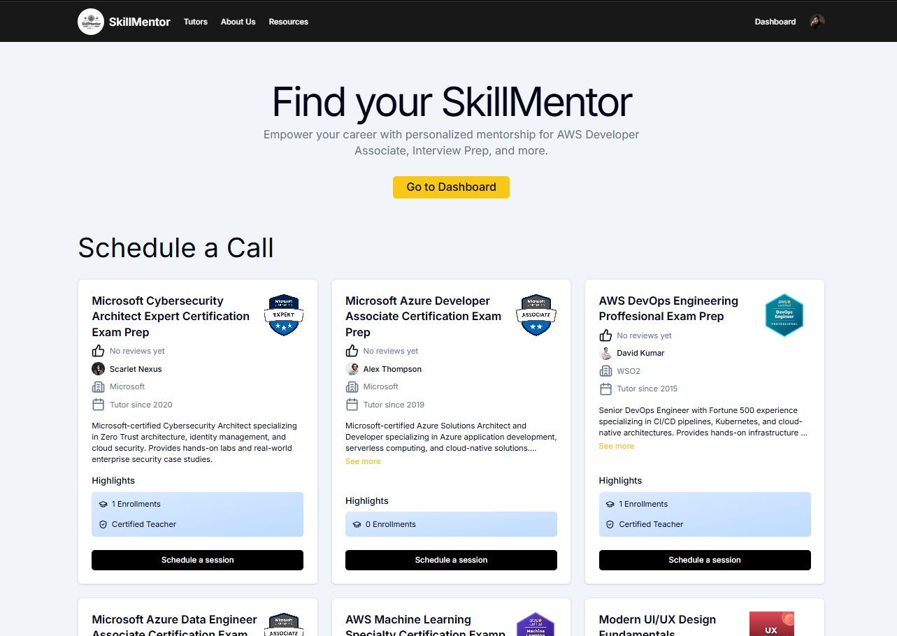
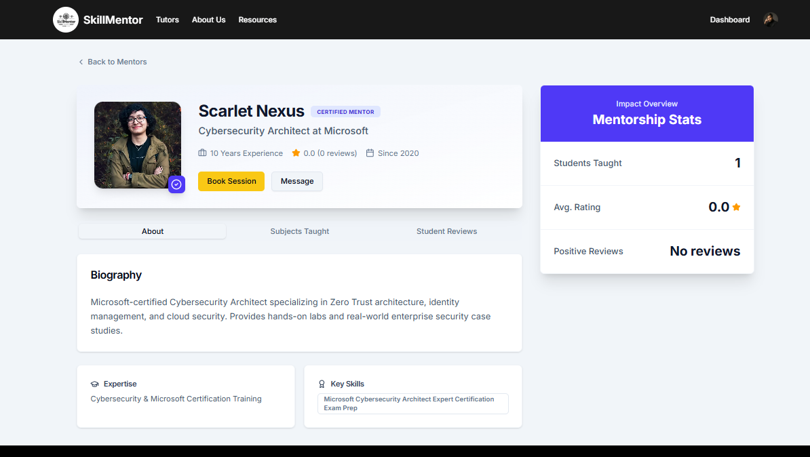
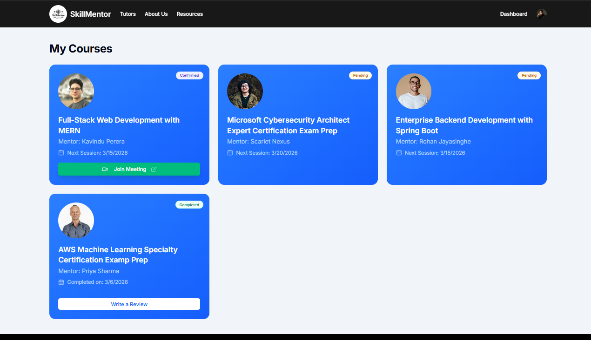
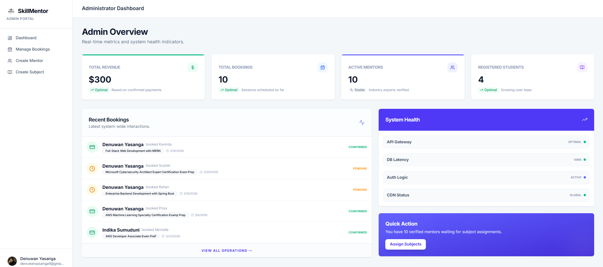
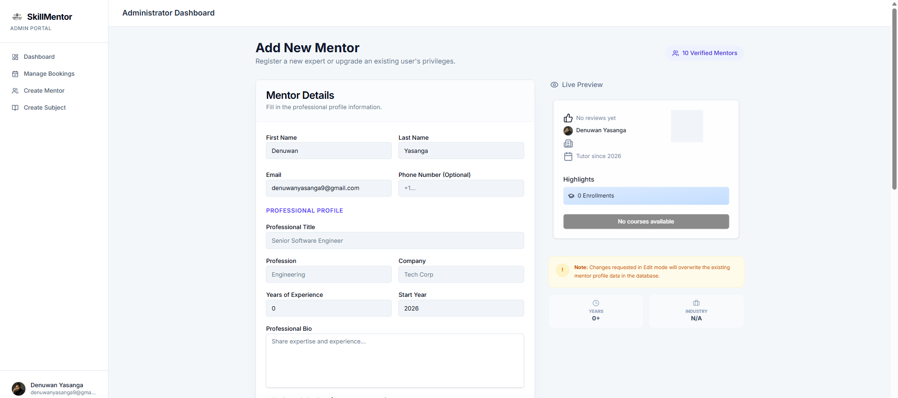
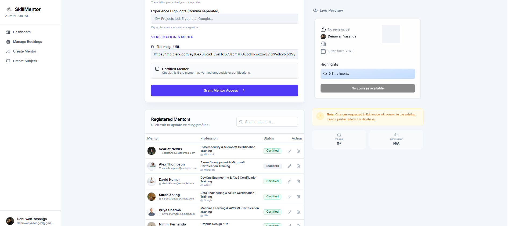
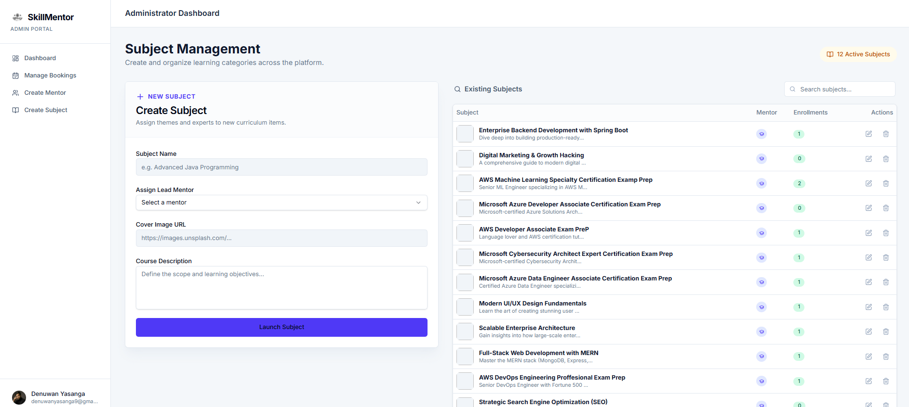
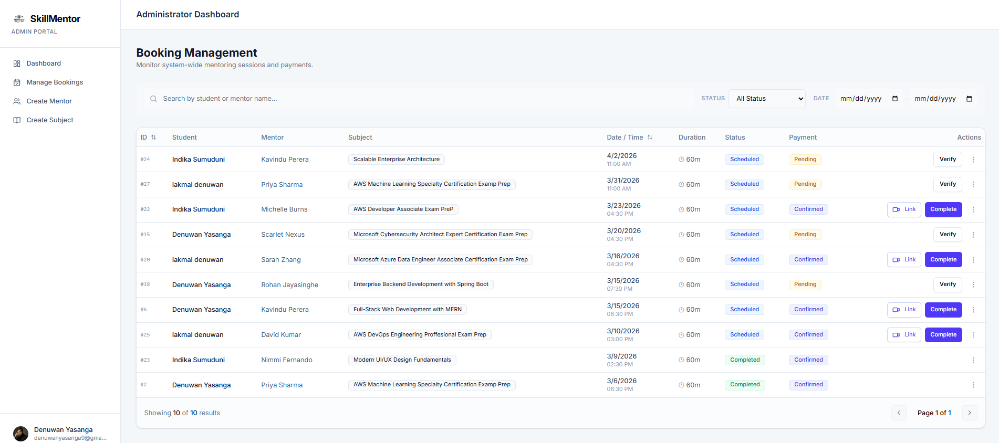

# SkillMentor - Online Mentoring Platform

> **An end-to-end online platform connecting students with expert mentors for specialized subjects.**
> Features role-based dashboards and a comprehensive session booking system.

[](#-deployed-links)
[](#-deployed-links)
[](https://clerk.com)

---

## 📋 Table of Contents

1. [Project Overview](#-project-overview)
2. [Core Features](#-core-features)
3. [Advanced Implemented Logic](#-advanced-implemented-logic)
4. [System Screenshots](#-system-screenshots)
5. [Tech Stack](#%EF%B8%8F-tech-stack)
6. [Getting Started](#-getting-started)
7. [Project Structure](#-project-structure)
8. [API Documentation](#-api-documentation)
9. [Deployed Links](#-deployed-links)
10. [Test Admin Account](#-test-admin-account)

---

## 🎯 Project Overview

**SkillMentor** is a full-stack Next-Generation Online Mentoring Platform that bridges the gap between eager learners and subject-matter experts. The platform empowers students to discover mentors by specialized subjects, book precise time-boxed learning sessions, upload bank-slip payment proofs, and track their entire educational journey via a personalized dashboard. 

Simultaneously, an exclusive administrative portal allows system administrators to seamlessly manage mentor onboarding, subject catalogues, booking confirmations, and live meeting deliveries.

Authentication and role-authorization are handled end-to-end by Clerk via robust `publicMetadata` claims.

---

## ✨ Core Features

### 👩‍🎓 Student Features
| Feature | Description |
|---|---|
| **Mentor Discovery** | Browse all available mentors and view highly detailed professional profiles. |
| **Session Booking** | Book sessions securely with strict date and time validation to prevent past-date selections. |
| **Payment Proof Upload** | Securely upload payment slips (bank slips) at checkout for manual admin review. |
| **Personal Dashboard** | Track session statuses in real-time. **When an admin provides a live meeting link, it instantly appears directly on your dashboard session card.** |

### 🛡️ Admin Features
| Feature | Description |
|---|---|
| **Role-Based Access Control** | Strictly gated layout; accessible only to accounts holding a `{"roles": "ADMIN"}` claim. |
| **Data-Rich Dashboard** | A highly visual dashboard displaying **Total Revenue, Total Bookings, Active Mentors, and Registered Students** at a glance. |
| **Mentor CRUD Management** | Admins can **create, edit, update details, and delete** mentors. Includes a beautiful **Live Preview Section** when creating new mentor profiles. |
| **Subject CRUD Management** | Admins can **create, edit, update, and delete** subjects. Includes a **Live Preview Section** when assigning subjects to mentors. |
| **Booking & Payment Management** | Admins manage all student bookings and manually confirm payments submitted via slip. |

---

## ⚙️ Advanced Implemented Logic

1. **Double-Booking Prevention**
   - The backend enforces aggressive validation logic preventing students from booking overlapping sessions for the same mentor.
   - It additionally rejects attempts to book duplicate subjects within the exact same time window.

2. **Performance (Keep-Alive Architecture)**
   - Render free-tier instances sleep after 15 idle minutes. To combat this, the Spring Boot application exposes a highly-optimized `/api/v1/health` endpoint.
   - **Cron-job.org** is scheduled to execute a ping against this endpoint every 14 minutes, keeping the backend constantly active.

---

## � System Screenshots

> *(Replace these placeholders with actual screenshots from your project directory)*

### 🎓 Student View
1. **Home / Mentor Discovery**  
   *()*
2. **Mentor Profile & Verification**  
   *()*
3. **Student Dashboard (Showing Live Meeting Link)**  
   *()*

### 🛡️ Admin View
1. **Admin Dashboard (Total Revenue, Active Mentors, Stats)**  
   *()*
2. **Mentor Creation (with Live Preview)**  
   *()*
   *()*
3. **Subject Management (CRUD operations)**  
   *()*
4. **Booking Table & Payment Confirmation**  
   *()*

---

## �️ Tech Stack

### Frontend Architecture
| Technology | Role |
|---|---|
| **React 19** + **TypeScript** | Core UI library & strictly typed safety |
| **Vite 7** | Lightning-fast build tooling and hot-module replacement |
| **Tailwind CSS 4** | Rapid utility-first styling architecture |
| **shadcn/ui** | Accessible, copy-paste component primitives |
| **Clerk** | Authentication provider & secure metadata storage |
| **Vercel** | Edge-network Frontend Deployment |

### Backend Architecture
| Technology | Role |
|---|---|
| **Spring Boot 3** (Java 17) | Enterprise-grade RESTful API framework |
| **Spring Security** | JWT lifecycle validation & endpoint security |
| **PostgreSQL** | Relational data persistence (hosted via **Supabase**) |
| **Render / Railway** | Cloud PaaS Platform for Backend Deployment |

---

## 🏁 Getting Started

### Prerequisites
- Node.js 20+ / npm 10+
- JDK 17+ and Maven
- A Supabase PostgreSQL Database (or local equivalent)
- A generic Clerk Application Profile

### 1 — Clone the Repository
Because this is a Mono-repository, the structure holds both frontend and backend side-by-side:
```bash
git clone https://github.com/<your-username>/skillmentor-platform.git
cd skillmentor-platform
```

### 2 — Backend Configuration (Spring Boot)
Navigate to the backend module:
```bash
cd backend
```
Update your `application.properties` to connect to your Supabase JDBC connection string:
```properties
spring.datasource.url=${DATABASE_URL}
spring.datasource.username=${DB_USERNAME}
spring.datasource.password=${DB_PASSWORD}
```

Run the API:
```bash
./mvnw clean install
./mvnw spring-boot:run
```

### 3 — Frontend Configuration (React + Vite)
Open a new terminal and navigate to the frontend:
```bash
cd frontend
```
Create a `.env` file referencing your Clerk keys:
```env
VITE_CLERK_PUBLISHABLE_KEY=pk_test_...
VITE_API_BASE_URL=http://localhost:8081
```

Run the Frontend:
```bash
npm install
npm run dev
```

---

## 📁 Project Structure

```text
skillmentor-platform/
│
├── frontend/                   ← React / TypeScript App (deployed on Vercel)
│   ├── src/
│   │   ├── components/         ← Shared UI components & Layouts
│   │   ├── pages/              ← Main Application Views
│   │   │   ├── admin/          ← Protected Admin Routes (Stats Dashboard, Subject/Mentor CRUD)
│   │   │   ├── DashboardPage.tsx
│   │   │   ├── MentorProfilePage.tsx
│   │   │   └── ...
│   │   ├── App.tsx             ← Router & RoleRedirect component
│   │   └── main.tsx            ← Vite Application Entry
│   └── package.json
│
└── backend/                    ← Spring Boot API (deployed on Render/Railway)
    ├── src/main/java/com/stemlink/skillmentor/
    │   ├── configs/            ← Security filters & public metadata validation
    │   ├── controllers/        ← Admin, Mentor, Session, Student, Subject, & Health APIs
    │   ├── dtos/               ← Data Transfer Objects mapped via ModelMapper
    │   ├── models/             ← Database Entities (JPA)
    │   ├── repositories/       ← Supabase Data Access Logic
    │   └── services/           ← Core Business Logic (Double-booking validation, etc.)
    ├── src/main/resources/
    │   └── application.properties
    └── pom.xml
```

---

## 📑 Complete API Documentation

The backend includes dynamic Swagger / OpenAPI Specification UI mapping. Below is a comprehensive list of core endpoints routing platform logic:

| Method | Endpoint | Auth Level | Description |
|---|---|---|---|
| `GET` | `/api/v1/health` | ❌ Public | **Keep-alive ping**. Prevents Render/Railway free-tier sleep cycles. |
| `GET` | `/api/v1/mentors` | ❌ Public | Retrieves all active mentors. |
| `GET` | `/api/v1/mentors/{id}` | ❌ Public | Retrieves specific mentor profile details. |
| `GET` | `/api/v1/subjects` | ❌ Public | Retrieves all subjects available on the platform. |
| `GET` | `/api/v1/sessions/my-sessions` | ✅ Student | Lists all bookings for the authenticated student. |
| `POST` | `/api/v1/sessions/enroll` | ✅ Student | Commits a booking. Exits with 400 if Double-Booking rules are violated. |
| `PUT` | `/api/v1/sessions/{id}/review` | ✅ Student | Posts a review for a completed session. |
| `GET` | `/api/v1/admin/bookings` | ✅ Admin | Retrieves all bookings across the platform. |
| `PUT` | `/api/v1/admin/bookings/{id}/confirm-payment` | ✅ Admin | Manual confirmation of student payment slip. |
| `PUT` | `/api/v1/admin/bookings/{id}/meeting-link` | ✅ Admin | **Attaches a Zoom/Meet link (shows instantly on Student Dashboard).** |
| `POST / PUT / DELETE`| `/api/v1/admin/mentors` (and `{id}`) | ✅ Admin | **Full CRUD Operations for mentors.** |
| `POST / PUT / DELETE`| `/api/v1/admin/subjects` (and `{id}`) | ✅ Admin | **Full CRUD Operations for subjects.** |
| `GET` | `/api/v1/subjects/stats` | ✅ Admin | **Fetches global statistics for the Admin Dashboard (Revenue, bookings, counts).** |

---

## 🌐 Deployed Links

| Application Service | Hosting Platform | URL |
|---|---|---|
| **Frontend Platform** | Vercel | [https://skillmentor-platform.vercel.app] |
| **Backend Swagger UI** | Render  | [https://skillmentor-platform.onrender.com/swagger-ui/index.html] |

---

## 🔑 Test Admin Account

**SkillMentor implements a zero-trust model; access solely relies on JWT claim injection.**  
To access the `/admin` application routes, the active user session must possess the exact JSON object referenced in Clerk's `publicMetadata`.

To provision an admin for testing:
1. Log into your **Clerk Platform Dashboard**.
2. Navigate to **Users** and click on your active test email.
3. Scroll down to the **Public Metadata** section.
4. Input the following configuration:
```json
{
  "roles": "ADMIN"
}
```
5. Click **Save Component**. On the next login, Admin can access the Admin Dshboard add this `/admin` end of the URL 'https://skillmentor-platform.vercel.app/admin'.


## 🔑 Admin Credentials:

Email: [denuwanyasanga02@gmail.com]
Password: [Denuwan123@]